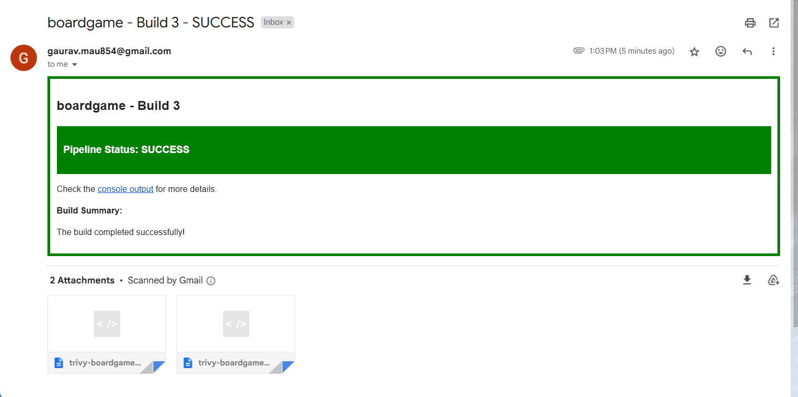

## BoardGame K8s Deployment Pipeline

### **Overview**

The goal of this project is to build a fully automated CI/CD pipeline and infrastructure setup for a **Java-based BoardGame** application. This setup ensures smooth code integration, testing, security scanning, artifact management, containerization, orchestration, and monitoring. The project leverages a suite of popular DevOps tools to ensure code quality, application security, scalability, and continuous delivery.

This pipeline automates the complete lifecycle of the project, from code push to deployment in a Kubernetes cluster.


### **CI/CD Workflow**


### **Technologies & Tools Used**

<a href="https://docs.aws.amazon.com/ec2/">
  
</a>
<a href="https://www.kernel.org">
  
</a>
<a href="https://git-scm.com">
  
</a>
<a href="https://github.com">
  
</a>
<a href="https://www.jenkins.io">
  
</a>
<a href="https://maven.apache.org">
  
</a>
<a href="https://github.com/tonistiigi/trivy">
  
</a>
<a href="https://www.docker.com">
  
</a>
<a href="https://help.sonatype.com/en/sonatype-nexus-repository.html">
  
</a>
<a href="https://docs.sonarsource.com/sonarqube-server/8.9/">
  
</a>
<a href="https://kubernetes.io">
  
</a>
<a href="https://prometheus.io/">
  
</a>
<a href="https://grafana.com/">
  
</a>
<a href="https://gmail.com">
  
</a>

---


## 🚀 Infrastructure Setup

To deploy the infrastructure on AWS, the following components need to be provisioned:

1. **Jenkins Server**
2. **Kubernetes Cluster** (with 1 Master and 2 Slave nodes)
3. **Nexus Server** (Artifact Repository)
4. **SonarQube Server** (Code Quality)
5. **Monitoring Server** (Prometheus + Grafana + Node Exporter + Blackbox)
6. **Security Scanning Server** (on Jenkins-Server- Trivy)


### AWS EC2 Instance Setup for Ubuntu

To create an EC2 instance on AWS with RHEL:

1. **Sign in to AWS Management Console**: Go to the [AWS Console](https://aws.amazon.com/console/) and log in with your AWS account.
2. **Navigate to EC2**: Search for EC2 and open the dashboard.
3. **Launch EC2 Instance**:

   * Choose **Red Hat Enterprise Linux 9 (HVM), SSD Volume Type** AMI.
   * Select the instance type (e.g., `t2.meduim` for testing).
4. **Configure Instance Details**: Leave the defaults for network settings.
5. **Add Storage and Tags**: Set default storage or adjust as needed.
6. **Security Group**: Open the required ports (detailed in the next section).
7. **Launch Instance**: Review and launch the instance.

Once the instance is running, use SSH to access it.

---

## 🔥 Firewall Configuration

Ensure the following ports are open on respective servers:

| Service       | Port        |
| ------------- | ----------- |
| Jenkins       | 8080        |
| Nexus         | 8081        |
| SonarQube     | 9000        |
| Prometheus    | 9090        |
| Grafana       | 3000        |
| Node Exporter | 9100        |
| Blackbox      | 9115        |
| K8s API       | 6443        |
| NodePort      | 30000-32767 |


---

## ⚙️ Jenkins Installation

Follow the steps below to install Jenkins on the server:

1. **Install Dependencies**:

   ```bash
   sudo yum install -y fontconfig java-21-openjdk wget tree curl vim net-tools
   java --version
   ```

2. **Add Jenkins Repository**:

   ```bash
   sudo wget -O /etc/yum.repos.d/jenkins.repo https://pkg.jenkins.io/redhat-stable/jenkins.repo
   sudo rpm --import https://pkg.jenkins.io/redhat-stable/jenkins.io-2023.key
   ```

3. **Install Jenkins**:

   ```bash
   sudo yum upgrade
   sudo yum install -y jenkins
   sudo systemctl enable --now jenkins
   sudo systemctl status jenkins
   ```

4. **Access Jenkins**:

   Get the Jenkins initial admin password:

   ```bash
   sudo cat /var/lib/jenkins/secrets/initialAdminPassword
   ```

   Visit: `http://<your-server-ip>:8080`


---

## 🧩 Jenkins Plugins to Install

1. **JDK**: Eclipse Temurin installer
2. **Maven**: Config File Provider, Pipeline Maven Integration
3. **SonarQube**: SonarQube Scanner
4. **Docker**: Docker, Docker Pipeline
5. **Kubernetes**: Kubernetes CLI, Client API, Credentials


---

## 🔍 Trivy Installation (Security Scanner) 

To install Trivy on Jenkins:

1. **Add Trivy Repository**:

   ```bash
   cat <<EOF | sudo tee /etc/yum.repos.d/trivy.repo
   [trivy]
   name=Trivy repository
   baseurl=https://aquasecurity.github.io/trivy-repo/rpm/releases/\$releasever/\$basearch/
   gpgcheck=0
   enabled=1
   EOF
   ```

2. **Install Trivy**:

   ```bash
   sudo yum -y update
   sudo yum -y install trivy
   trivy --version
   ```

---

## 🐳 Docker Installation

To install Docker on jenkins, sonarqube & nexus servers:

```bash
sudo dnf -y install dnf-plugins-core
sudo dnf config-manager --add-repo https://download.docker.com/linux/rhel/docker-ce.repo
sudo dnf install -y docker-ce docker-ce-cli containerd.io docker-buildx-plugin docker-compose-plugin

sudo systemctl enable --now docker
docker run hello-world
```

---

## 📦 Nexus (Artifact Repository) server configuration

To set up Nexus on Docker:

1. **Pull Nexus Image**:

   ```bash
   docker pull sonatype/nexus3
   ```

2. **Run Nexus**:

   ```bash
   docker run -d --name nexus -p 8081:8081 sonatype/nexus3
   ```

   Access Nexus: `http://<your-server-ip>:8081`

3. **Get Admin Password**:

   ```bash
   docker exec -it nexus cat /opt/sonatype/sonatype-work/nexus3/admin.password
   ```

---

## 📊 SonarQube (Code Quality) server configuration 

To run SonarQube on Docker:

1. **Run SonarQube**:

   ```bash
   docker run -d --name sonar -p 9000:9000 sonarqube:lts-community
   ```

   Access SonarQube: `http://<your-server-ip>:9000`

   Default credentials: `admin / admin`

---

## 🧑‍🔧 Docker Group Permissions

Ensure Jenkins, SonarQube, and Nexus can use Docker by adding them to the Docker group:

```bash
sudo usermod -aG docker jenkins
sudo usermod -aG docker sonar
sudo usermod -aG docker nexus
sudo usermod -aG docker $USER
newgrp docker  # or re-login
```

---

## ☸️ Kubernetes Cluster Setup

### Pre-requisites:

1. **Disable SELinux and Swap**:

   ```bash
   sudo setenforce 0
   sudo sed -i 's/^SELINUX=enforcing$/SELINUX=permissive/' /etc/selinux/config
   sudo swapoff -a
   sudo sed -i '/ swap / s/^\(.*\)$/#\1/g' /etc/fstab
   ```

2. **Enable Necessary Modules**:

   ```bash
   cat <<EOF | sudo tee /etc/modules-load.d/k8s.conf
   overlay
   br_netfilter
   EOF

   sudo modprobe overlay
   sudo modprobe br_netfilter
   ```

3. **Configure sysctl settings**:

   ```bash
   cat <<EOF | sudo tee /etc/sysctl.d/k8s.conf
   net.bridge.bridge-nf-call-iptables  = 1
   net.bridge.bridge-nf-call-ip6tables = 1
   net.ipv4.ip_forward                 = 1
   EOF

   sudo sysctl --system
   ```

---

### Install Container Runtime (containerd):

```bash
sudo dnf install -y containerd.io
sudo mkdir -p /etc/containerd
containerd config default | sudo tee /etc/containerd/config.toml
sudo sed -i 's/SystemdCgroup = false/SystemdCgroup = true/g' /etc/containerd/config.toml
sudo systemctl restart containerd
```

---

### Install Kubernetes:

1. **Add Kubernetes Repo**:

   ```bash
   cat <<EOF | sudo tee /etc/yum.repos.d/kubernetes.repo
   [kubernetes]
   name=Kubernetes
   baseurl=https://pkgs.k8s.io/core:/stable:/v1.30/rpm/
   enabled=1
   gpgcheck=1
   gpgkey=https://pkgs.k8s.io/core:/stable:/v1.30/rpm/repodata/repomd.xml.key
   exclude=kubelet kubeadm kubectl cri-tools kubernetes-cni
   EOF
   ```

2. **Install Kubernetes Packages**:

   ```bash
   sudo yum update -y
   sudo yum install -y kubelet kubeadm kubectl --disableexcludes=kubernetes
   sudo systemctl enable --now kubelet
   ```

---

### Initialize Kubernetes Control Plane:

```bash
sudo kubeadm init --ignore-preflight-errors=all
mkdir -p $HOME/.kube
sudo cp -i /etc/kubernetes/admin.conf $HOME/.kube/config
sudo chown $(id -u):$(id -g) $HOME/.kube/config
```

---

### Install Calico CNI (Networking):

```bash
kubectl apply -f https://raw.githubusercontent.com/projectcalico/calico/v3.26.0/manifests/calico.yaml
```
`


## 📁 GitHub Repository Setup

### Create GitHub Repository
- Repository: `https://github.com/Gaurav1517/boardgame-deployment.git`

### Create GitHub Access Token
- Go to: **Settings > Developer Settings > Personal Access Tokens > Tokens (classic)**
- Click **Generate New Token**  
  - Name: `github-token`  
  - Scope: Select all scopes  
  - Save token securely (you will not see it again after page refresh)

### Push Source Code to GitHub

```bash
git init
git add .
git commit -m "source code"
git config --global user.name "Gaurav Chauhan"
git config --global user.email "gaurav.cloud000@gmail.com"
git branch -M main
git remote add origin https://github.com/Gaurav1517/boardgame-deployment.git
git push origin -u main
````
---

## 🔑 Jenkins Credentials Setup

> Dashboard > Manage Jenkins > Credentials > System > Global credentials (unrestricted)


---

## 🔗 SonarQube Webhook (For Jenkins Integration)

* Go to **SonarQube > Administration > Webhooks**
* Add New Webhook:

  * **Name:** jenkins
  * **URL:** `http://192.168.70.135:8080/sonar-webhook/`
  

## Maven config


## Docker config


## jdk-17 config for application


# 📧 Jenkins Email Notification Setup

### Create App Password on Gmail

Use App Password (not actual Gmail password) for authentication.

### Configure in Jenkins:

> Manage Jenkins > System

#### Extended E-mail Notification

* **SMTP Server:** `smtp.gmail.com`
* **SMTP Port:** `465`
* **Use SSL:** ✅
* **Credentials:** `<email-ID>` / `app-password` (ID: `mail-cred`)

#### E-mail Notification

* **SMTP Server:** `smtp.gmail.com`
* **SMTP Port:** `465`
* **Use SMTP Authentication:** ✅
* **User Name:** `<email-ID>`
* **Password:** `app-password`
* **Use SSL:** ✅

#### Test Email

* Recipient: `<email-ID>`
* Status: ✅ Successfully sent


---

# Install kubectl on jenkins server
```bash
#!/bin/bash

set -e  # Exit immediately if a command exits with a non-zero status

echo "📥 Downloading the latest kubectl binary..."
curl -LO "https://dl.k8s.io/release/$(curl -Ls https://dl.k8s.io/release/stable.txt)/bin/linux/amd64/kubectl"

echo "🔐 Making kubectl executable..."
chmod +x kubectl

echo "🚚 Moving kubectl to /usr/local/bin (requires sudo)..."
sudo mv kubectl /usr/local/bin/

echo "✅ Verifying kubectl installation..."
kubectl version --client

echo "🎉 kubectl installation completed successfully!"
```
---

## 🔐 Kubernetes RBAC Configuration for Jenkins

> 🔗 [RBACK Configuration](https://github.com/jaiswaladi246/EKS-Complete/blob/main/Steps-eks.md)

### 1. Namespace

```yaml
apiVersion: v1
kind: Namespace
metadata:
  name: webapps
```

```bash
kubectl create -f namespace.yaml
kubectl get ns | grep webapps
```

### 2. Service Account

```yaml
apiVersion: v1
kind: ServiceAccount
metadata:
  name: jenkins
  namespace: webapps
```

```bash
kubectl create -f serviceAccount.yaml
kubectl get serviceaccounts -n webapps
```

### 3. Role

```yaml
apiVersion: rbac.authorization.k8s.io/v1
kind: Role
metadata:
  name: app-role
  namespace: webapps
rules:
  - apiGroups:
      - ""
      - apps
      - autoscaling
      - batch
      - extensions
      - policy
      - rbac.authorization.k8s.io
    resources:
      - pods
      - secrets
      - componentstatuses
      - configmaps
      - daemonsets
      - deployments
      - events
      - endpoints
      - horizontalpodautoscalers
      - ingress
      - jobs
      - limitranges
      - namespaces
      - nodes
      - pods
      - persistentvolumes
      - persistentvolumeclaims
      - resourcequotas
      - replicasets
      - replicationcontrollers
      - serviceaccounts
      - services
    verbs: ["get", "list", "watch", "create", "update", "patch", "delete"]
```

```bash
kubectl create -f role.yaml
kubectl get role -n webapps
kubectl describe role app-role -n webapps
```

### 4. RoleBinding

```yaml
apiVersion: rbac.authorization.k8s.io/v1
kind: RoleBinding
metadata:
  name: app-rolebinding
  namespace: webapps 
roleRef:
  apiGroup: rbac.authorization.k8s.io
  kind: Role
  name: app-role 
subjects:
- namespace: webapps 
  kind: ServiceAccount
  name: jenkins 
```

```bash
kubectl create -f role-bind.yaml
kubectl get rolebindings -n webapps
```

### 5. Generate Token for Jenkins

```yaml
apiVersion: v1
kind: Secret
type: kubernetes.io/service-account-token
metadata:
  name: mysecretname
  namespace: webapps 
  annotations:
    kubernetes.io/service-account.name: jenkins
```

```bash
kubectl create -f secret.yaml -n webapps
kubectl get secrets -n webapps
kubectl describe secret mysecretname -n webapps
```

> 🔗 [Service Account Token Reference](https://kubernetes.io/docs/reference/access-authn-authz/service-accounts-admin)


---

### Configure Manage files, Add this server cred in Manged files.
Dashboard > Manage Jenkins > Managed files
```bash
<server>
      <id>maven-release</id>
      <username>admin</username>
      <password>password</password>
    </server>
     <server>
      <id>maven-snapshots</id>
      <username>admin</username>
      <password>password</password>
    </server>
```


## Nexus repo  config repository & shapshot url in pom.xml file. 

```bash
 <distributionManagement>
        <repository>
            <id>maven-releases</id>
            <url>http://<Nexus-server-IP>:8081/repository/maven-releases/</url>
        </repository>
        <snapshotRepository>
            <id>maven-snapshots</id>
            <url>http://<Nexus-Server-IP>:8081/repository/maven-snapshots/</url>
        <snapshotRepository>
    </distributionManagement>
```

---

## 📦 Kubernetes Deployment and Service

### `deployment-service.yaml`

```yaml
apiVersion: apps/v1
kind: Deployment
metadata:
  name: boardgame-deployment
spec:
  selector:
    matchLabels:
      app: boardgame
  replicas: 2
  template:
    metadata:
      labels:
        app: boardgame
    spec:
      containers:
        - name: boardgame
          image: gchauhan1517/boardgame:latest
          imagePullPolicy: Always
          ports:
            - containerPort: 8080
---
apiVersion: v1
kind: Service
metadata:
  name: boardgame-ssvc
spec:
  selector:
    app: boardgame
  ports:
    - protocol: TCP
      port: 8080
      targetPort: 8080
  type: LoadBalancer
```

---

# RUn jenkins pipeline 

```bash
pipeline {
    agent any

    tools {
        jdk 'jdk-17'
        dockerTool 'docker'
        maven 'maven'
    }

    environment {
        SCANNER_HOME = tool "sonar-scanner"
        DOCKER_USERNAME = "gchauhan1517"
    }

    stages {
        stage('Set Job Name Lower') {
            steps {
                script {
                    env.JOB = env.JOB_NAME.toLowerCase()
                }
            }
        }

        stage('Git Checkout') {
            steps {
                git branch: 'main', credentialsId: 'git-cred', url: 'https://github.com/Gaurav1517/boardgame-deployment.git'
            }
        }

        stage('Compile') {
            steps {
                sh 'mvn compile'
            }
        }

        stage('Maven Test') {
            steps {
                sh 'mvn test'
            }
        }

        stage('File System Scan') {
            steps {
                sh "trivy fs --format table -o trivy-${env.JOB}-fs-report.html ."
            }
        }

        stage('SonarQube Analysis') {
            steps {
                withSonarQubeEnv('sonar') {
                    sh """
                        ${SCANNER_HOME}/bin/sonar-scanner \
                        -Dsonar.projectName=${env.JOB} \
                        -Dsonar.projectKey=${env.JOB} \
                        -Dsonar.java.binaries=.
                    """
                }
            }
        }

        stage('Quality Gate') {
            steps {
                script {
                    waitForQualityGate abortPipeline: false, credentialsId: 'sonar-token'    
                }
            }
        }

        stage('Build') {
            steps {
                sh 'mvn package'
            }
        }

        stage('Publish to Nexus') {
            steps {
                withMaven(globalMavenSettingsConfig: 'global-settings', jdk: 'jdk-17', maven: 'maven', traceability: true) {
                    sh 'mvn deploy'
                }
            }
        }

        stage('Docker Build & Tag') {
            steps {
                script {
                    sh "docker build -t ${env.JOB}:${BUILD_NUMBER} ."
                    sh "docker tag ${env.JOB}:${BUILD_NUMBER} ${DOCKER_USERNAME}/${env.JOB}:v${BUILD_NUMBER}"
                    sh "docker tag ${env.JOB}:${BUILD_NUMBER} ${DOCKER_USERNAME}/${env.JOB}:latest"
                }
            }
        }

        stage('Docker Image Scan') {
            steps {
                sh "trivy image --format table -o trivy-${env.JOB}-image-report.html ${DOCKER_USERNAME}/${env.JOB}:v${BUILD_NUMBER}"
            }
        }

        stage('Docker Image Push') {
            steps {
                script {
                    withCredentials([usernamePassword(credentialsId: 'docker-hub-creds', passwordVariable: 'docker_pass', usernameVariable: 'docker_user')]) {
                        sh "docker login -u '${docker_user}' -p '${docker_pass}'"
                        sh "docker push ${docker_user}/${env.JOB}:v${BUILD_NUMBER}"
                        sh "docker push ${docker_user}/${env.JOB}:latest"
                    }
                }
            }
        }

        stage('Deploy on Kubernetes') {
            steps {
                withKubeConfig(caCertificate: '', clusterName: 'kubernetes', contextName: '', credentialsId: 'k8s-cred', namespace: 'webapps', restrictKubeConfigAccess: false, serverUrl: 'https://192.168.70.130:6443') {
                    sh "kubectl apply -f deployment-service.yaml"
                }
            }
        }

        stage('Verify the Deployment') {
            steps {
                withKubeConfig(caCertificate: '', clusterName: 'kubernetes', contextName: '', credentialsId: 'k8s-cred', namespace: 'webapps', restrictKubeConfigAccess: false, serverUrl: 'https://192.168.70.130:6443') {
                    sh "kubectl get pod -n webapps"
                    sh "kubectl get svc -n webapps"
                }
            }
        }
    }

    post {
        always {
            script {
                def jobName = env.JOB_NAME
                def buildNumber = env.BUILD_NUMBER
                def pipelineStatus = currentBuild.result ?: 'UNKNOWN'
                def bannerColor = pipelineStatus == 'SUCCESS' ? 'green' : 'red'

                def body = """<html>
                                <body>
                                    <div style="border: 4px solid ${bannerColor}; padding: 10px;">
                                        <h2>${jobName} - Build ${buildNumber}</h2>
                                        <div style="background-color: ${bannerColor}; padding: 10px;">
                                            <h3 style="color: white;">Pipeline Status: ${pipelineStatus}</h3>
                                        </div>
                                        <p>Check the <a href="${env.BUILD_URL}">console output</a> for more details.</p>
                                        <p><strong>Build Summary:</strong></p>
                                        <p>${pipelineStatus == 'SUCCESS' ? 'The build completed successfully!' : 'The build failed. Please check the logs for errors.'}</p>
                                    </div>
                                </body>
                              </html>"""

                echo "Sending email to: <email-ID>"
                emailext(
                    subject: "${jobName} - Build ${buildNumber} - ${pipelineStatus}",
                    body: body,
                    to: '<email-ID>',
                    from: '<email-ID>',
                    replyTo: '<email-ID',
                    mimeType: 'text/html',
                    attachmentsPattern: "trivy-${env.JOB}-*.html"
                )
            }
        }
    }
}

```
## Pipeline snap




---


# Prometheus v3.4.1 Installation and Setup on Linux

## 1. Download and Extract Prometheus

```bash
wget https://github.com/prometheus/prometheus/releases/download/v3.4.1/prometheus-3.4.1.linux-amd64.tar.gz
mkdir -p /opt/prometheus
tar -xvzf prometheus-3.4.1.linux-amd64.tar.gz -C /opt/prometheus --strip-components=1
rm -f prometheus-3.4.1.linux-amd64.tar.gz
```

---

## 2. Create Prometheus User and Directories

```bash
sudo useradd --no-create-home --shell /bin/false prometheus
sudo mkdir -p /etc/prometheus /var/lib/prometheus
sudo chown -R prometheus:prometheus /opt/prometheus /etc/prometheus /var/lib/prometheus
```

---

## 3. Copy Configuration Files

```bash
sudo cp /opt/prometheus/prometheus.yml /etc/prometheus/
sudo chown prometheus:prometheus /etc/prometheus/prometheus.yml
```
---

## 4. Create systemd Service File

Create `/etc/systemd/system/prometheus.service` with:

```bash
sudo tee /etc/systemd/system/prometheus.service > /dev/null <<EOF
[Unit]
Description=Prometheus Monitoring
Wants=network-online.target
After=network-online.target

[Service]
User=prometheus
Group=prometheus
Type=simple
ExecStart=/opt/prometheus/prometheus \\
  --config.file=/etc/prometheus/prometheus.yml \\
  --storage.tsdb.path=/var/lib/prometheus/

Restart=always

[Install]
WantedBy=multi-user.target
EOF
```

---

## 5. Reload systemd and Start Prometheus

```bash
sudo systemctl daemon-reload
sudo systemctl enable prometheus
sudo systemctl start prometheus
```

---

## 6. Verify Prometheus Service Status

```bash
sudo systemctl status prometheus
```

## 7. Access Prometheus UI

Open your browser to:

```
http://<your-server-ip>:9090
```

---


## ✅ Step-by-Step: Install & Start Grafana on RHEL/CentOS

### 🔹 1. Download and Install Grafana Enterprise

```bash
sudo yum install -y https://dl.grafana.com/enterprise/release/grafana-enterprise-12.0.1-1.x86_64.rpm
```

> 💡 You can use `dnf` instead of `yum` if you're on a newer RHEL version:
>
> ```bash
> sudo dnf install -y https://dl.grafana.com/enterprise/release/grafana-enterprise-12.0.1-1.x86_64.rpm
> ```

---

### 🔹 2. Enable and Start Grafana Server

```bash
sudo systemctl daemon-reexec
sudo systemctl daemon-reload
sudo systemctl enable grafana-server
sudo systemctl start grafana-server
```

---

### 🔹 3. Check Grafana Status

```bash
sudo systemctl status grafana-server
```

You should see:
`Active: active (running)`

---

### 🔹 4. Open Grafana in Browser

Visit:

```
http://<your-server-ip>:3000
```

### 🔐 Default login:

* **Username:** `admin`
* **Password:** `admin` (you will be prompted to change it)

---

### 🔹 5. Add Prometheus as a Data Source in Grafana

Once logged into Grafana:

1. Go to **"Gear" → "Data Sources"**.
2. Click **"Add data source"**.
3. Choose **Prometheus**.
4. In the URL field, enter:

   ```
   http://localhost:9090
   ```

   (or the IP where Prometheus is running)
5. Click **"Save & Test"**.

---

### 🔹 6. (Optional) Import a Dashboard

* Go to **"Dashboards" → "Import"**
* Use an existing dashboard ID from [Grafana Dashboards](https://grafana.com/grafana/dashboards/)

  * For example: **1860** (Prometheus Stats)

---


# Download blackbox exporter 
NOTE": Before insalling blackbox exporter change is prometheus configureation file 

vim /etc/prometheus/prometheus.yml

```yaml
# my global config
global:
  scrape_interval: 15s
  evaluation_interval: 15s

alerting:
  alertmanagers:
    - static_configs:
        - targets: []

rule_files: []

scrape_configs:
  - job_name: "prometheus"
    static_configs:
      - targets: 
          - "<prometheus-IP>:9090"

  - job_name: 'blackbox'
    metrics_path: /probe
    params:
      module: [http_2xx]  # Look for a HTTP 200 response.
    static_configs:
      - targets:
        - http://prometheus.io    # Target to probe with http.
        - http://<192.168.70.130:30248> # k8s master node ip with deploymnet service port.
    relabel_configs:
      - source_labels: [__address__]
        target_label: __param_target
      - source_labels: [__param_target]
        target_label: instance
      - target_label: __address__
        replacement: <192.168.70.135:9115>  # The blackbox exporter's real hostname:port.
```

###  Restart Prometheus to Apply Config
sudo systemctl restart prometheus
sudo systemctl status prometheus


### 🔹 1. Download & Install Blackbox Exporter

```bash
# Download
wget https://github.com/prometheus/blackbox_exporter/releases/download/v0.26.0/blackbox_exporter-0.26.0.linux-amd64.tar.gz

# Extract
mkdir -p /opt/blackbox_exporter
tar -xvzf blackbox_exporter-0.26.0.linux-amd64.tar.gz -C /opt/blackbox_exporter --strip-components=1
rm -f blackbox_exporter-0.26.0.linux-amd64.tar.gz

# Create system user
sudo useradd --no-create-home --shell /bin/false blackbox_exporter

# Set permissions
sudo chown -R blackbox_exporter:blackbox_exporter /opt/blackbox_exporter
```

---

### 🔹 2. Create systemd Service File

```bash
sudo tee /etc/systemd/system/blackbox_exporter.service > /dev/null <<EOF
[Unit]
Description=Prometheus Blackbox Exporter
Wants=network-online.target
After=network-online.target

[Service]
User=blackbox_exporter
Group=blackbox_exporter
Type=simple
ExecStart=/opt/blackbox_exporter/blackbox_exporter --config.file=/opt/blackbox_exporter/blackbox.yml

Restart=always

[Install]
WantedBy=multi-user.target
EOF
```

---

### 🔹 3. Start the Blackbox Exporter

```bash
sudo systemctl daemon-reload
sudo systemctl enable blackbox_exporter
sudo systemctl start blackbox_exporter
sudo systemctl status blackbox_exporter
```


### 🔹 6. Test in Browser or CLI

**Test Blackbox Exporter is listening:**

```bash
curl "http://localhost:9115/probe?target=https://www.google.com&module=http_2xx"
```

---

## Install plugins 
Prometheus metricsVersion

## ✅ Step-by-Step: Install Node Exporter (v1.9.1)

### 🔹 1. Download & Extract

```bash
cd ~
wget https://github.com/prometheus/node_exporter/releases/download/v1.9.1/node_exporter-1.9.1.linux-amd64.tar.gz

# Extract to /opt
mkdir -p /opt/node_exporter
tar -xvzf node_exporter-1.9.1.linux-amd64.tar.gz -C /opt/node_exporter --strip-components=1

# Remove archive
rm -f node_exporter-1.9.1.linux-amd64.tar.gz
```

---

### 🔹 2. Create a User

```bash
sudo useradd --no-create-home --shell /bin/false node_exporter
sudo chown -R node_exporter:node_exporter /opt/node_exporter
```

---

### 🔹 3. Create systemd Service

```bash
sudo tee /etc/systemd/system/node_exporter.service > /dev/null <<EOF
[Unit]
Description=Prometheus Node Exporter
Wants=network-online.target
After=network-online.target

[Service]
User=node_exporter
Group=node_exporter
Type=simple
ExecStart=/opt/node_exporter/node_exporter

Restart=always

[Install]
WantedBy=multi-user.target
EOF
```

---

### 🔹 4. Start & Enable Service

```bash
sudo systemctl daemon-reload
sudo systemctl enable node_exporter
sudo systemctl start node_exporter
sudo systemctl status node_exporter
```

You should see `Active: active (running)` ✅

---

### 🔹 6. Add to Prometheus Scrape Config (Optional)

Edit `/etc/prometheus/prometheus.yml` and add:

```yaml
  - job_name: "node_exporter_9100"
  static_configs:
    - targets:
        - "192.168.70.135:9100"

- job_name: "custom_metrics_8080"
  metrics_path: '/prometheus'
  static_configs:
    - targets:
        - "192.168.70.135:8080"

```

Then restart Prometheus:

```bash
sudo systemctl restart prometheus
```

---

## ✅ Final Verification

* **Browser**: Visit `http://<your-server-ip>:9100/metrics`
* **Prometheus UI**: Check target status under **Status > Targets**
* **Metrics**: Search for `node_cpu_seconds_total`, `node_memory_MemAvailable_bytes`, etc.


## Monitoring Outputs


---


# Reference Links

Here are some useful reference links for various tools and installation guides:

- **Docker Installation**: [https://docs.docker.com/engine/install/rhel/](https://docs.docker.com/engine/install/rhel/)
- **Docker Hub**: [https://hub.docker.com/](https://hub.docker.com/)
- **Git Installation**: [https://git-scm.com/downloads/linux](https://git-scm.com/downloads/linux)
- **Nexus Docker Hub Image**: [https://hub.docker.com/r/sonatype/nexus3](https://hub.docker.com/r/sonatype/nexus3)
- **SonarQube Docker Hub Image**: [https://hub.docker.com/layers/library/sonarqube/lts-community/images/sha256-d3d04c0fec696dcf92657ae25ee5662aba32b1a44f61571ea7b1adca001a647a](https://hub.docker.com/layers/library/sonarqube/lts-community/images/sha256-d3d04c0fec696dcf92657ae25ee5662aba32b1a44f61571ea7b1adca001a647a)
- **Jenkins Installation**: [https://www.jenkins.io/doc/book/installing/linux/#red-hat-centos](https://www.jenkins.io/doc/book/installing/linux/#red-hat-centos)
- **Trivy Installation**: [https://trivy.dev/v0.18.3/installation/](https://trivy.dev/v0.18.3/installation/)
- **Kubernetes Cluster Setup**: [https://v1-32.docs.kubernetes.io/docs/setup/production-environment/tools/kubeadm/install-kubeadm/](https://v1-32.docs.kubernetes.io/docs/setup/production-environment/tools/kubeadm/install-kubeadm/)
- **Calico Network**: [https://archive-os-3-26.netlify.app/calico/3.26/getting-started/kubernetes/self-managed-onprem/onpremises](https://archive-os-3-26.netlify.app/calico/3.26/getting-started/kubernetes/self-managed-onprem/onpremises)
- **K8s RBAC**: [https://kubernetes.io/docs/reference/access-authn-authz/rbac/](https://kubernetes.io/docs/reference/access-authn-authz/rbac/)
- **K8s ServiceAccount**: [https://kubernetes.io/docs/reference/access-authn-authz/service-accounts-admin/](https://kubernetes.io/docs/reference/access-authn-authz/service-accounts-admin/)
- **Kubectl Download**: [https://kubernetes.io/docs/tasks/tools/install-kubectl-linux/](https://kubernetes.io/docs/tasks/tools/install-kubectl-linux/)
- **Prometheus Download**: [https://prometheus.io/download/](https://prometheus.io/download/)
- **Grafana Download**: [https://grafana.com/grafana/download](https://grafana.com/grafana/download)
- **Node Exporter Dashboard**: [https://grafana.com/grafana/dashboards/1860-node-exporter-full/](https://grafana.com/grafana/dashboards/1860-node-exporter-full/)
- **Prometheus Blackbox Exporter**: [https://grafana.com/grafana/dashboards/7587-prometheus-blackbox-exporter/](https://grafana.com/grafana/dashboards/7587-prometheus-blackbox-exporter/)
- **Prometheus Configuration**: [https://github.com/prometheus/blackbox_exporter](https://github.com/prometheus/blackbox_exporter)

---
